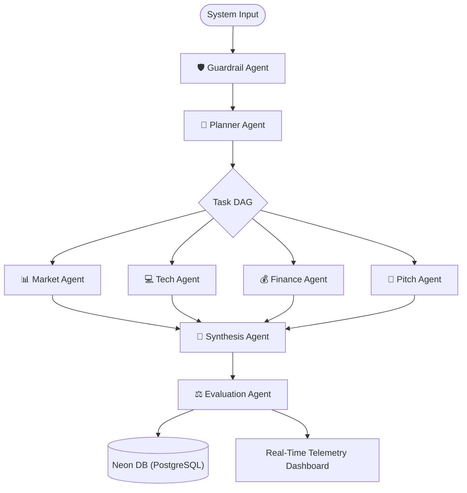
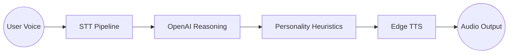

# Sounak Saha
## Architect of Agentic AI Systems
[sahasounak.jobs@gmail.com](mailto:sahasounak.jobs@gmail.com) | [GitHub](https://github.com/Saha-Sounak) | [LinkedIn](https://www.linkedin.com/in/sahasounak/) | Vizag, India

---

### 🚀 Core Platform: Launchpad AI
**AI Startup Simulator: Swarm-Powered Venture Validation**
> A coordinated swarm of **8 specialized agents** collaborating to build, validate, and pitch venture ideas in real-time.

#### ⚙️ Swarm Architecture

**The 8-Agent Swarm:**
1.  **📊 Market Agent**: Conducts deep-dive research into audiences and competitors via Tavily.
2.  **💻 Tech Agent**: Designs cloud-native architectures and product roadmaps.
3.  **💰 Finance Agent**: Models revenue streams and burn rates.
4.  **🎤 Pitch Agent**: Generates brand identity and elevator pitches.
5.  **🧩 Synthesis Agent**: Consolidates research into unified strategic briefings.
6.  **⚖️ Evaluation Agent**: Harsh VC critic scoring ventures on 1-100 metrics.
7.  **📅 Planner Agent**: Dynamically builds the Task DAG for simulation flow.
8.  **🛡️ Guardrail Agent**: Ensures semantic validity and system security.

**Key Features:**
- **Real-Time Telemetry**: Live log streaming and agent execution status via FastAPI.
- **Granular Cost Tracking**: 100% transparency on OpenAI API spend per-token and per-action.
- **Neural Intel Briefings**: Executive high-level summaries for every completed simulation task.
- **Persistence**: Automated simulation history syncing to Neon PostgreSQL.

---

### 🎙️ Multimodal AI Therapy Companion
**Voice-First Interaction Agent**
> An end-to-end voice-first AI pipeline designed for conversational reasoning and emotional resonance.

#### 🔊 Pipeline Flow

**Key Capabilities:**
- **Asynchronous FastAPI Backend**: Handled concurrent STT/TTS pipelines for real-time responsiveness.
- **Personality-Driven System Prompts**: Enabled distinct AI personas with controlled pacing, tone, and emotional response rules.
- **Signal-Level Speech Heuristics**: Implemented pauses, pacing, and turn-taking to improve conversational naturalness.

---

### 🧠 The Neural Stack (Skills)

| Category | Technologies |
| :--- | :--- |
| **LLMs & AI Systems** | RAG Pipelines, Multi-Agent Swarms, Prompt Engineering, Semantic Search (PGVector) |
| **Intelligence** | OpenAI (GPT-4o), Sentence Transformers, Tavily AI, Trafilatura |
| **Backend & APIs** | Python, FastAPI, Flask, Asyncio, asyncpg, REST APIs |
| **Frontend & UI** | React, Tailwind CSS, Framer Motion, Lucide React |
| **Data & Databases** | Neon (PostgreSQL), MongoDB, Pinecone, Pandas |
| **Infrastructure** | Docker, Git, Github Actions, Hugging Face Spaces |

---

### 🎓 Education
**B.Tech in Computer Science**  
*Sai University, Chennai, India* (Sep '21 - Jun '25)

---
